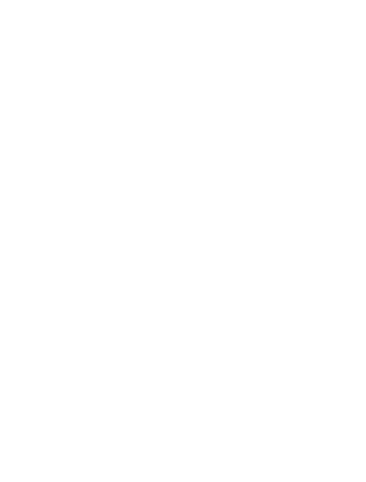

# The Grand Tour

This replays the launch of Voyager 1 and Voyager 2 along with all
of the planets.

Serve this directory with

    python -mSimpleHTTPServer 8000

And point your web browser at http://localhost:8000/ to watch.

# Assets and sources

Voyager SVG is adapted from [Wikimedia commons - Voyager_structure.svg](https://commons.wikimedia.org/wiki/File:Voyager_spacecraft_structure_vector.svg).

Planet and voyager positions from [NASA JPL Horizons](https://ssd.jpl.nasa.gov/horizons.cgi):
* Ephermeris type Vector
* Coordinate Origin Sun (500@10)
* Time span 1977-09-06 to 2007-01-01 step 1d
* table settings
  * quantities code=2
  * output units=KM-S
  * labels=NO
  * CSV format=YES

Voyager audio is from [archive.org Voyager 1](https://archive.org/details/Voyager1)

Processed image from [trmm.net/Voyager](https://trmm.net/Voyager)

